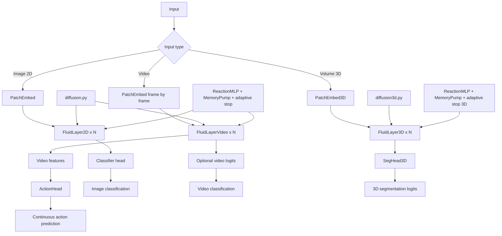
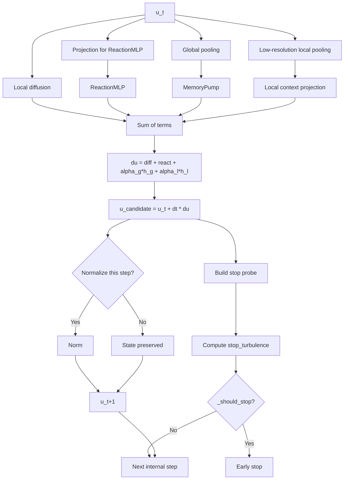

# FluidVLA Core

This directory contains the algorithmic core of FluidVLA.

Here lies the logic that defines the project's identity:

- local, iterative computation inspired by PDEs
- multi-scale diffusion instead of global attention
- position-wise learned reaction term
- lightweight global and local memory
- adaptive compute via early stopping at equilibrium

The goal of this README is to answer four questions:

1. what is the foundational architecture of FluidVLA
2. why the core is split across multiple files
3. what changes between 2D, video, VLA, and medical 3D
4. how to connect these building blocks to the repository's experiments

---

## Overview

FluidVLA replaces the classic transformer scheme:

- tokenizer or patchify
- global self-attention
- MLP

with a local reaction-diffusion scheme:

- simple patch embedding
- local multi-scale diffusion
- position-wise nonlinear reaction
- compact memory
- multiple internal steps until approximate equilibrium

At a high level, the pipeline looks like this:

```text
Input
  -> Patch embedding
  -> N iterative fluid layers
  -> Lightweight task-specific head

Patch embedding
  -> converts image / video / volume into a latent tensor

Fluid layer
  -> local diffusion
  -> position-wise reaction
  -> global memory
  -> low-resolution local memory
  -> periodic normalization
  -> early stopping in eval if turbulence becomes low

Head
  -> 2D classification
  -> optional video classification
  -> action head for VLA
  -> 3D segmentation for medical
```

Simplified mathematical form of one internal step:

$$
u_{t+1} = u_t + \Delta t \left[ \operatorname{Diff}(u_t) + \operatorname{React}(u_t) + \alpha_g h_g + \alpha_l h_l \right]
$$

where:

- $\operatorname{Diff}(u_t)$ is local propagation via a multi-scale discrete Laplacian
- $\operatorname{React}(u_t)$ is a local MLP transformation
- $h_g$ is a compact global memory
- $h_l$ is a low-resolution local context re-injected into the state

This scheme is the common foundation. The different files in this directory do not change this philosophy; they adapt it to different geometries and tasks.

---

## Foundational Architecture

```text
Common foundation
  diffusion.py / diffusion3d.py
    -> local propagation operators

  fluid_layer.py / fluid_layer3d.py
    -> complete reaction-diffusion dynamics

  vision_models.py
    -> 2D image -> classification

  video_models.py
    -> video -> spatio-temporal encoder

  vla_models.py
    -> video encoder -> pooling -> action head

  fluid_medical_model.py
    -> 3D volume -> segmentation

Public facade
  __init__.py
    -> stable import point for the rest of the repo

Historical compatibility
  fluid_model.py
    -> compatibility shim that re-exports the public classes
```

The key point is that the hierarchy goes from most fundamental to most specific:

1. diffusion = lowest-level local operators
2. fluid_layer = complete dynamics of a fluid layer
3. models = assemblies of fluid layers for a given task
4. facade = stable public API for the repo

### Architecture Diagram



This diagram shows the actual hierarchy of the core:

- diffusion operators are at the bottom
- fluid layers build the complete dynamics
- specialized models adapt that dynamics to a task
- the fluidvla.core facade hides this organization from the rest of the repo

---

## Tensor Shapes

This section serves as a concrete reference for understanding inputs, outputs, and conversions between modules.

### Patch embeddings

#### Shapes from [vision_models.py](vision_models.py)

- PatchEmbed input: $(B, C, H, W)$
- PatchEmbed output: $(B, D, H', W')$
- with $H' = H / p$ and $W' = W / p$ if the size is divisible by the patch size $p$

#### [fluid_medical_model.py](fluid_medical_model.py)

- PatchEmbed3D input: $(B, C, D, H, W)$
- PatchEmbed3D output: $(B, D_m, D', H', W')$
- with spatial reduction according to the 3D stride of the patch embedding

### Fluid layers

#### [fluid_layer.py](fluid_layer.py) for 2D images

- FluidLayer2D input: $(B, C, H, W)$
- FluidLayer2D output: $(B, C, H, W)$
- the layer preserves the latent resolution; it transforms the state but does not resample it

#### [fluid_layer.py](fluid_layer.py) for video

- FluidLayerVideo input: $(B, C, T, H, W)$
- FluidLayerVideo output: $(B, C, T, H, W)$
- the temporal dimension is preserved; the dynamics operate in both space and time

#### [fluid_layer3d.py](fluid_layer3d.py)

- FluidLayer3D input: $(B, C, D, H, W)$
- FluidLayer3D output: $(B, C, D, H, W)$
- the layer preserves the volumetric latent grid

### High-level models

#### [vision_models.py](vision_models.py)

```text
Image (B, C, H, W)
  -> PatchEmbed
  -> latent (B, D, H', W')
  -> FluidLayer2D x N
  -> pooled (B, D)
  -> logits (B, num_classes)
```

#### Shapes from [video_models.py](video_models.py)

```text
Video (B, C, T, H, W)
  -> reshape frames into batch (B*T, C, H, W)
  -> PatchEmbed
  -> latent frames (B*T, D, H', W')
  -> rebuild video latent (B, D, T, H', W')
  -> FluidLayerVideo x N
  -> features (B, D, T, H', W')
  -> optional logits (B, num_classes)
```

#### Shapes from [vla_models.py](vla_models.py)

```text
Frames (B, C, T, H, W)
  -> FluidBotVideo
  -> features (B, D, T, H', W')
  -> AdaptiveAvgPool3d(1)
  -> pooled (B, D)
  -> optional concat proprio (B, D + P)
  -> actions (B, action_dim)
```

#### Shapes from [fluid_medical_model.py](fluid_medical_model.py)

```text
Volume (B, C, D, H, W)
  -> PatchEmbed3D
  -> latent (B, D_m, D', H', W')
  -> FluidLayer3D x N
  -> latent refined (B, D_m, D', H', W')
  -> upsample to original size
  -> logits (B, K, D, H, W)
```

### Where shapes actually change

- patch embedding: changes spatial or volumetric resolution
- fluid layers: keep latent resolution constant
- final pooling: compresses the representation for classification or action
- segmentation head: upsamples back to original resolution on the medical side

---

## Why multiple files

The split is not there to look "cleaner" in an abstract way. It addresses real technical differences.

### 1. Separating diffusion operators from the rest

The files [diffusion.py](diffusion.py) and [diffusion3d.py](diffusion3d.py) do only one thing: locally propagate a latent state using fixed stencils and learned coefficients.

They do not handle:

- memory
- nonlinear reaction
- early stopping logic
- the output head

This separation is useful because diffusion is the most "physical" and most reusable building block.

### 2. Separating fluid dynamics from final models

The files [fluid_layer.py](fluid_layer.py) and [fluid_layer3d.py](fluid_layer3d.py) implement the complete reaction-diffusion layer.

They combine:

- diffusion
- reaction
- memory
- normalization
- equilibrium logic
- diagnostics

The model files above then simply assemble these layers according to the task.

### 3. Separating 2D/video/3D when the geometry truly changes

The cost, tensors, and physical meaning change between:

- a 2D image
- a spatio-temporal video
- a 3D medical volume

Trying to fit everything into a single highly abstract super-class would make the code harder to read and riskier to evolve.

### 4. Keeping a stable public API despite refactors

[__init__.py](__init__.py) and [fluid_model.py](fluid_model.py) exist to prevent experiments from having to track the entire internal structure.

The rest of the repo should be able to import the important classes via:

```python
from fluidvla.core import FluidBotClassifier, FluidBotVideo, FluidBotVLA, FluidBotMedical3D
```

The core can evolve internally as long as this facade remains stable.

---

## Role of each file

### [__init__.py](__init__.py)

Stable public facade.

This file re-exports the core's important symbols:

- FluidBotClassifier
- FluidBotVideo
- FluidBotVLA
- FluidBotMedical3D
- PatchEmbed
- PatchEmbed3D
- SegHead3D
- ActionHead

Its role is purely architectural: stabilizing external imports.

### [fluid_model.py](fluid_model.py)

Compatibility shim.

Historically, this file contained classifier, video, and VLA in a single module. After refactoring, it re-exports these building blocks from the specialized modules.

It exists to avoid unnecessary breakage of:

- legacy imports
- notebooks
- historical scripts
- external tools not yet migrated

It no longer carries the main logic.

### Role of [vision_models.py](vision_models.py)

2D image models file.

It contains:

- PatchEmbed
- FluidBotClassifier

Its role:

- convert an image into a patchified latent grid
- stack FluidLayer2D layers
- produce a classification output

Pipeline:

```text
Image (B, C, H, W)
  -> PatchEmbed
  -> FluidLayer2D x N
  -> Global average pooling
  -> Linear classifier
```

Typical usage:

- MNIST
- CIFAR
- simple image classification

### Role of [video_models.py](video_models.py)

Video models file.

It contains:

- FluidBotVideo

Its role:

- patchify each frame with the same 2D PatchEmbed
- reconstruct a latent video tensor
- apply FluidLayerVideo layers that diffuse in space and time
- optionally output video classification logits

Pipeline:

```text
Video (B, C, T, H, W)
  -> PatchEmbed applied frame by frame
  -> latent tensor (B, D, T, H', W')
  -> FluidLayerVideo x N
  -> video features
  -> optional classification head
```

Typical usage:

- MovingMNIST
- video tracking or prediction
- visual encoder for VLA

### Role of [vla_models.py](vla_models.py)

Vision-language-action models file in the practical sense of the repo, i.e., vision to action.

It contains:

- ActionHead
- FluidBotVLA

Its role:

- reuse FluidBotVideo as a visual encoder
- perform global pooling of video features
- optionally fuse proprioceptive input
- predict a continuous action

Pipeline:

```text
Video frames
  -> FluidBotVideo
  -> pooled visual features
  -> optional proprio concat
  -> ActionHead
  -> action vector
```

Typical usage:

- step2_sim
- step2a_synthetic
- step2d_so101_urdf
- step3_lerobot

### Role of [fluid_medical_model.py](fluid_medical_model.py)

3D medical models file.

It contains:

- PatchEmbed3D
- SegHead3D
- FluidBotMedical3D

Its role:

- patchify a 3D volume with a strided Conv3D
- apply FluidLayer3D layers
- interpolate back to original volume size
- produce voxel-wise segmentation logits

Pipeline:

```text
Volume (B, C, D, H, W)
  -> PatchEmbed3D
  -> FluidLayer3D x N
  -> upsample
  -> SegHead3D
  -> segmentation logits
```

Typical usage:

- CT / MRI segmentation
- step1b_medical_msd

### [fluid_layer.py](fluid_layer.py)

Central file for 2D and video fluid dynamics.

It contains:

- RMSNorm
- MemoryPump
- ReactionMLP
- _FluidLayerBase
- FluidLayer2D
- FluidLayerVideo

Its role:

- encapsulate the reusable reaction-diffusion core
- provide early stopping logic
- expose diagnostics useful for research

This file is the true dynamic core of the 2D and video branch.

### Volumetric case: [fluid_layer3d.py](fluid_layer3d.py)

Volumetric counterpart of fluid_layer.py.

It contains:

- RMSNorm
- MemoryPump
- ReactionMLP
- FluidLayer3D

Its role:

- apply the same paradigm to 3D volumes
- manage local memory at low volumetric resolution
- diffuse over a volumetric neighborhood instead of a 2D grid or a video

This file is not a simple duplication. It carries decisions specific to the volumetric case:

- 3D geometry
- higher memory cost
- 3D local pooling
- trilinear interpolation
- stop probe in depth-height-width

### Non-volumetric branch: [diffusion.py](diffusion.py)

Library of non-volumetric diffusion operators.

It contains:

- Laplacian1D
- Laplacian2D
- LaplacianSpatioTemporal

Its role:

- provide low-level local propagation
- cleanly separate discrete physics from the rest of the model

The three variants cover:

- experimental 1D sequences
- 2D images
- spatio-temporal videos

### Volumetric branch: [diffusion3d.py](diffusion3d.py)

3D volumetric version of diffusion.

It contains:

- _make_laplacian_kernel_3d
- Laplacian3D

Its role:

- locally propagate information within a volume
- learn a per-channel, per-scale diffusion strength
- remain strictly local, with no global mechanism like attention

---

## What a Fluid Layer does exactly

A Fluid Layer is the iterative computation core of the project.

It does not settle for a single feed-forward pass. It performs multiple internal steps to let the latent state reorganize locally.

Each step follows this idea:

1. compute local diffusion
2. compute position-wise nonlinear reaction
3. update a compact global memory
4. build a low-resolution local memory
5. combine these terms in an explicit update with a learned $\Delta t$
6. normalize periodically
7. measure a low-resolution turbulence to determine whether the state has stabilized

On output, the layer returns:

- the new latent state
- research diagnostics, for example:
  - steps_used
  - equilibrium_step
  - final_turbulence
  - min_turbulence
  - diff_turbulence
  - pde_active

These diagnostics matter: they make the adaptive compute observable and analyzable.

---

## Adaptive Compute

A key aspect of the FluidVLA core is that a layer does not necessarily consume the same number of internal steps on every call in evaluation mode.

The idea is straightforward:

- if the latent state is still changing significantly, continue iterating
- if the latent state stabilizes, stop early

This approximates variable-budget computation rather than a network with strictly fixed depth.

### How stopping is decided

Early stopping relies on a compact turbulence measure:

1. build a low-resolution probe of the current state
2. compare this probe to the probe from the previous step
3. normalize this variation to obtain a relative turbulence
4. if this turbulence stays below the threshold epsilon for several steps, consider the state as close to a local equilibrium

The logic is intentionally conservative:

- active only in eval
- waits at least min_steps
- requires stop_patience consecutive steps below the threshold

### Meaning of diagnostics

- steps_used:
  number of internal steps actually executed

- equilibrium_step:
  first step where turbulence fell below the threshold

- final_turbulence:
  turbulence measured at the last executed step

- min_turbulence:
  lowest turbulence observed during iteration

- diff_turbulence:
  differentiable enriched version of turbulence, also combining update energy and diffusion energy

- pde_active:
  indicates whether PDE diffusion is active or not in the layer

### Why this is useful

For a researcher, these signals serve multiple purposes:

- understanding whether the dynamics converge quickly or not
- comparing PDE ON vs PDE OFF
- studying stability across tasks
- estimating the actual internal cost beyond just the number of layers

In practice, FluidVLA does not behave like a simple fixed feed-forward stack. It behaves more like an iterative system bounded by max_steps but allowed to stop earlier if the state settles.

### Internal diagram of a Fluid Layer



This diagram is useful for distinguishing two things that are often conflated:

- the latent state update itself
- the monitoring logic that decides whether to continue or stop

The stop turbulence is not just a hidden loss. It is an operational metric for steering the internal budget during evaluation.

---

## Key Hyperparameters

This section serves as a practical guide for knowing which parameters affect what, and in what order to consider them.

### Global capacity parameters

- d_model:
  width of the main latent. Higher values increase representational capacity but raise memory and compute cost everywhere.

- n_layers:
  number of stacked fluid layers. This is the external depth, distinct from the number of internal steps per layer.

- patch_size:
  aggressiveness of initial spatial reduction. Large patch_size reduces cost but removes fine detail early on.

### Internal dynamics parameters

- max_steps:
  hard ceiling on the number of internal steps per layer. Larger values give the dynamics more time to stabilize but increase max cost.

- dt:
  initial time step for explicit integration. Too large can make the dynamics jittery; too small can make convergence too slow.

- alpha:
  weight of memory injected into the dynamics. Present explicitly in fluid layers, then relayed implicitly via learned alpha_global and alpha_local.

- epsilon:
  stability threshold for early stopping. Lower = later, stricter stopping; higher = more aggressive stopping.

### Diffusion parameters

- dilations, spatial_dilations, temporal_dilations:
  local propagation radii per scale. These determine the diffusion horizon without resorting to dense global connectivity.

- signed_diffusion:
  allows signed coefficients for more expressive, potentially less constrained research variants.

- diffusion_scale:
  maximum or effective amplitude of learned diffusion depending on the module. An important knob to avoid propagation that is too weak or too aggressive.

- causal_time:
  for video, enforces strictly causal dynamics in time.

- temporal_mode:
  selects the form of temporal video diffusion. backward_diff is consistent with real-time causal processing; symmetric_laplacian is more suited for offline use.

### Stability and monitoring parameters

- norm_every:
  normalization frequency. Normalizing too often can dampen the dynamics; too rarely can let them drift further.

- stop_patience:
  number of consecutive steps below epsilon required before stopping. Increasing this value makes stopping more robust but less aggressive.

- min_steps:
  safeguard that enforces a minimum number of internal steps before allowing early stopping.

- stop_probe_hw, stop_probe_t, stop_probe_dhw:
  resolution of the probe used to measure turbulence. The more compact the probe, the more stopping is based on coarse-grained stability rather than fine-grained noise.

### Local memory parameters

- local_memory_hw:
  low-resolution local context size for 2D and video.

- local_memory_dhw:
  low-resolution local context size for 3D volumes.

These parameters control the tradeoff between:

- richness of the re-injected local context
- memory cost and interpolation
- sensitivity to fine details versus broader structures

### Task head parameters

- num_classes:
  size of the image or video classification head.

- action_dim:
  dimension of the continuous control output for the VLA branch.

- proprio_dim:
  size of the proprioceptive input concatenated in ActionHead.

- n_classes:
  number of segmentation classes on the medical 3D side.

### Practical hyperparameter guide

When looking to adjust the core without breaking everything, the pragmatic order is often:

1. d_model and n_layers for global capacity
2. patch_size for the cost vs. detail tradeoff
3. max_steps, epsilon, stop_patience, and min_steps for the internal budget
4. dilations and diffusion_scale for propagation range
5. local_memory_* for local context quality
6. temporal_mode and causal_time only for video variants

### Hyperparameters by module family

#### 2D Image

- d_model
- n_layers
- patch_size
- dilations
- max_steps
- epsilon
- local_memory_hw

#### Video

- d_model
- n_layers
- patch_size
- spatial_dilations
- temporal_dilations
- causal_time
- temporal_mode
- stop_probe_t

#### VLA

- all video hyperparameters
- action_dim
- proprio_dim

#### Medical 3D

- d_model
- n_layers
- patch_size 3D
- dilations 3D
- local_memory_dhw
- stop_probe_dhw
- n_classes

---

## Difference between fluid_layer.py and fluid_layer3d.py

They implement the same idea but on different geometries.

### What is identical

- local reaction MLP
- global memory via MemoryPump
- low-resolution local memory
- explicit update with $\Delta t$
- periodic normalization
- early stopping in eval
- turbulence diagnostics

### What actually changes

#### In [fluid_layer.py](fluid_layer.py)

- supports 2D and video
- contains _FluidLayerBase shared by FluidLayer2D and FluidLayerVideo
- compact 2D or video local memory
- 2D spatial or spatio-temporal diffusion
- stop probe on height-width or time-height-width

#### In [fluid_layer3d.py](fluid_layer3d.py)

- supports 3D volumes only
- no base class factored with 2D, because volumetric details quickly dominate
- low-resolution local memory in depth-height-width
- trilinear interpolation
- volumetric stop probe
- significantly different compute and memory cost

In practice, fully merging these two files would lose more readability than it would gain in abstraction.

---

## Difference between diffusion.py and diffusion3d.py

### [diffusion.py](diffusion.py)

Contains operators for:

- 1D
- 2D
- spatio-temporal video

It therefore covers cases where the data structure is a sequence, an image, or a video.

### [diffusion3d.py](diffusion3d.py)

Contains the pure volumetric version.

The 3D Laplacian is not just a copy-paste of the 2D version with an extra dimension. Costs change, the stencil changes, and dilation or coefficient choices have a different effect on medical volumes.

---

## Difference between vision_models, video_models, vla_models, and fluid_medical_model

These files are distinguished not by "importance" but by the type of final task.

### vision_models

Simplest case.

- image input
- 2D fluid layers
- classification head

### video_models

Video encoder version.

- video input
- frame-by-frame patchification
- video fluid layers
- video feature output

### vla_models

Decision / control version.

- reuses the video encoder
- compresses the visual state
- transforms it into a continuous action
- can integrate proprioceptive input

### fluid_medical_model

Volumetric segmentation version.

- 3D volume input
- 3D patchification
- 3D fluid layers
- voxel-wise segmentation head

The core remains the same, but the head and geometry change according to the task.

---

## Foundational architecture then derivatives

The best way to understand this directory is to see the models as successive derivatives of a common foundation.

### Minimal foundation

```text
Patch embedding
  -> latent state u
  -> Fluid Layer x N
  -> task head
```

### 2D classification derivative

```text
PatchEmbed
  -> FluidLayer2D x N
  -> classification head
```

### Video derivative

```text
PatchEmbed on each frame
  -> latent video reconstruction
  -> FluidLayerVideo x N
  -> video features or classification
```

### VLA derivative

```text
FluidBotVideo
  -> global pooling
  -> optional proprio concat
  -> ActionHead
```

### Medical 3D derivative

```text
PatchEmbed3D
  -> FluidLayer3D x N
  -> SegHead3D
  -> volumetric logits
```

This decoupling allows maintaining a single conceptual foundation while adapting the last part of the pipeline to the experimental context.

---

## Recommended Presets by Context

This section does not provide universally "optimal" settings. It provides stable starting points for entering each experiment family without over-sizing the core too early.

General rule:

- start with a modest latent
- keep few layers initially
- then calibrate the internal budget: max_steps, epsilon, min_steps, and stop_patience
- only increase diffusion range if the current local context is too short

### Quick table: preset vs. cost vs. risk

| Context | Starting point | Initial cost | Instability risk | Associated experimental evidence |
| --- | --- | --- | --- | --- |
| MNIST | `d_model=32`, `n_layers=2`, `patch_size=4` | low | low | [Root README - Step 0](../../README.md#step-0---image-classification) |
| Video | `d_model=32`, `n_layers=2`, `seq_len=6`, `epsilon=0.08` | low to moderate | moderate | [Root README - Step 1](../../README.md#step-1---video-scaling-and-adaptive-compute) |
| Medical 3D | `d_model=32`, `n_layers=2`, `max_steps=6`, `diffusion_scale=0.08`, `batch_size=1` | high | moderate to high | [Root README - Step 1b](../../README.md#step-1b---medical-3d--msd) |
| Practical VLA | `d_model=64` to `128`, `n_layers=2`, conservative video encoder | moderate | moderate | [Root README - Step 2a](../../README.md#step-2a---synthetic-imitation-learning) |

### Good starting point for MNIST

Context:

- simple 2D image classification task
- useful for quickly validating that the spatial core learns and converges
- associated branch: [experiments/step0_mnist/README.md](../../experiments/step0_mnist/README.md)
- corresponding experimental evidence: [Root README - Step 0](../../README.md#step-0---image-classification)

Recommended preset:

- model: `FluidBotClassifier`
- `d_model=32`
- `n_layers=2`
- `patch_size=4`
- `max_steps=4` to `6`
- short spatial dilations
- conservative `epsilon` if adaptive stopping is enabled

Concrete starting command:

```bat
python experiments/step0_mnist/train_step0.py --dataset mnist --model small
```

Why this preset:

- small enough to iterate quickly
- large enough to see if PDE dynamics already provide a real signal
- good starting point before moving to CIFAR-10 or increasing capacity

When to scale up:

- if MNIST converges too quickly and plateaus low, increase `d_model` first
- if the model lacks structural capacity, then increase `n_layers`
- only adjust `patch_size` after that, as it is a more aggressive cost vs. detail knob

### Good starting point for video

Context:

- validation of spatio-temporal diffusion and adaptive compute
- associated branch: [experiments/step1_video/README.md](../../experiments/step1_video/README.md)
- corresponding experimental evidence: [Root README - Step 1](../../README.md#step-1---video-scaling-and-adaptive-compute)

Recommended preset:

- model: `FluidBotVideo`
- `d_model=32`
- `n_layers=2`
- `seq_len=6`
- moderate `max_steps`
- `epsilon=0.08`
- `min_steps=3`
- `stop_patience=2`
- causal or quasi-causal temporal diffusion depending on the protocol

Concrete starting command:

```bat
python experiments/step1_video/train_step1_video.py --workers 0 --batch_size 8 --epochs 1 --seq_len 6 --d_model 32 --n_layers 2 --max_train_samples 512 --max_test_samples 128 --epsilon 0.08 --min_steps 3 --stop_patience 2
```

Why this preset:

- small enough to quickly calibrate `steps_used` and `final_turbulence` diagnostics
- rich enough to see if temporal diffusion has a real effect
- avoids mixing memory scaling questions with pure quality concerns too early

When to scale up:

- increase `seq_len` first to test temporal range
- then increase `d_model`
- only make stopping more aggressive after observing a stable regime with `epsilon=0.08` or `0.09`

### Good starting point for medical 3D

Context:

- volumetric segmentation, memory cost is much more sensitive
- associated branch: [experiments/step1b_medical_msd/README.md](../../experiments/step1b_medical_msd/README.md)
- corresponding experimental evidence: [Root README - Step 1b](../../README.md#step-1b---medical-3d--msd)

Recommended preset:

- model: `FluidBotMedical3D`
- `d_model=32`
- `n_layers=2`
- `max_steps=6`
- `diffusion_scale=0.08`
- `batch_size=1`
- canonical crop `128x128x128` for most MSD tasks
- exception Hippocampus: `64x64x64`
- exception Prostate: `128x128x64`
- exception Pancreas, HepaticVessel, Colon: `crop_mode mixed`

Concrete starting command:

```bat
python experiments/step1b_medical_msd/train_fluidvla_msd.py --task Task09_Spleen --data_dir ./data/step1b_medical_msd/Task09_Spleen --binary --epochs 5 --batch_size 1 --max_train_samples 16 --max_val_samples 4 --d_model 32 --n_layers 2 --max_steps 6 --diffusion_scale 0.08
```

Why this preset:

- it follows the most conservative regime already used in the active medical branch
- it limits the risk of confusing volumetric instability, GPU memory shortage, and poor architecture choices
- it serves as a clean baseline before heavier variants

When to scale up:

- increase the number of samples or epochs first before widening the core
- if the volume is too heavy, reduce the crop before reducing `d_model`
- reserve changes to 3D dilations and local memory for cases where anatomical context is clearly lacking

### Good starting point for practical VLA

Context:

- continuous control from visual sequences
- associated branches: [experiments/step2_sim/README.md](../../experiments/step2_sim/README.md), [experiments/step2a_synthetic/README.md](../../experiments/step2a_synthetic/README.md), [experiments/step3_lerobot/README.md](../../experiments/step3_lerobot/README.md)
- corresponding experimental evidence: [Root README - Step 2a](../../README.md#step-2a---synthetic-imitation-learning)

Recommended preset:

- model: `FluidBotVLA`
- start with a small, stable video encoder first
- `d_model=64` to `128` depending on the budget
- `n_layers=2`
- moderate `max_steps`
- add proprio only after visual pipeline validation

Pragmatic reading:

- if perception is still fragile, tune the video part first
- if perception is good but action is noisy, then look at `action_dim`, the action head, and proprio fusion

---

## Connection to repository experiments

The core is not isolated from the rest of the repo. It directly feeds the experimental steps.

### Image classification

- step0_mnist uses FluidBotClassifier

### Video hyperparameters

- step1_video uses FluidBotVideo

### Medical 3D hyperparameters

- step1b_medical_msd uses FluidBotMedical3D

### Robotics and action

- step2_sim, step2a_synthetic, step2d_so101_urdf, and step3_lerobot use FluidBotVLA

In other words, fluidvla/core is not a theoretical sandbox. It is the operational foundation of the active experiments.

---

## Why not merge everything into a single file

It would be technically possible, but it would be a bad idea for a research repository.

What would be lost:

- readability of the 2D, video, and 3D variants
- understanding of tradeoffs specific to each geometry
- ease of audit for a researcher who wants to understand a specific branch
- safety during refactors

What would be gained:

- fewer files
- an impression of centralization

That gain is superficial. For a research core, the current separation is more honest and more maintainable.

---

## Design Tradeoffs

This architecture does not try to be universal. It makes deliberate choices.

### What the design prioritizes

- locality of computation
- interpretability of internal mechanisms
- better-controlled cost compared to dense global attention
- natural adaptation to 2D grids, videos, and 3D volumes
- instrumentation of internal dynamics via diagnostics

### What is gained over global attention

- no quadratic global attention matrix
- more physical inductive bias for spatial or volumetric tasks
- clear separation between propagation, reaction, and memory
- more natural behavior for contexts where local causality matters

### What is lost compared to a classic transformer

- less explicit mechanism for instantaneous global dependencies
- greater importance placed on dilation choices and internal step count
- analysis sometimes more subtle because effective depth depends on the state

### Why this choice is coherent here

The repository primarily targets cases where local structure matters strongly:

- image
- video
- visual robotics
- medical volumes

In these contexts, the reaction-diffusion paradigm provides a useful structural bias rather than a mere stylistic replacement for attention.

The core was therefore not split into multiple files out of a taste for modularization, but because each geometry imposes its own tradeoffs on:

- diffusion stencils
- local memory
- stability probes
- compute and memory cost
- the final output head

---

## Recommended reading order

To understand the project core in the right order:

1. [diffusion.py](diffusion.py) and [diffusion3d.py](diffusion3d.py)
2. [fluid_layer.py](fluid_layer.py) then [fluid_layer3d.py](fluid_layer3d.py)
3. [vision_models.py](vision_models.py)
4. [video_models.py](video_models.py)
5. [vla_models.py](vla_models.py)
6. [fluid_medical_model.py](fluid_medical_model.py)
7. [__init__.py](__init__.py) to see the stable public API

If you want to understand the "why" before the "how", read this README first, then fluid_layer.py.

---

## Short summary

- [diffusion.py](diffusion.py) and [diffusion3d.py](diffusion3d.py) = raw local propagation
- [fluid_layer.py](fluid_layer.py) and [fluid_layer3d.py](fluid_layer3d.py) = complete fluid dynamics
- [vision_models.py](vision_models.py) = 2D image
- [video_models.py](video_models.py) = video
- [vla_models.py](vla_models.py) = vision to action
- [fluid_medical_model.py](fluid_medical_model.py) = 3D segmentation
- [__init__.py](__init__.py) = stable facade
- [fluid_model.py](fluid_model.py) = historical compatibility

The project core is therefore both conceptually unified and technically separated where geometry, task, or import stability demands it.

---

## Smoke Tests

A minimal smoke test now accompanies this core in [tests/test_core_smoke.py](../tests/test_core_smoke.py).

It verifies:

- that the fluidvla.core public facade exposes the expected classes
- that the main models can be instantiated
- that the main output shapes are consistent on a minimal forward pass

Typical command:

```bash
pytest tests/test_core_smoke.py
```
